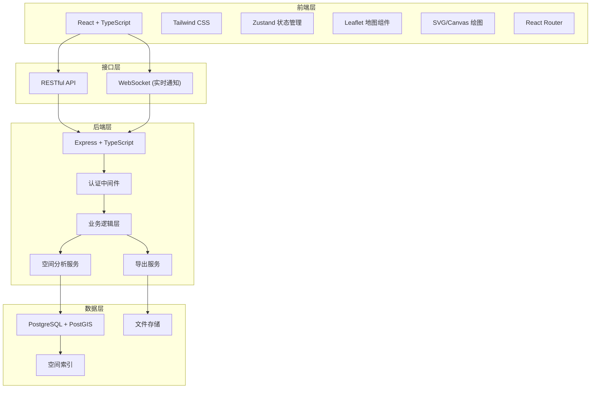
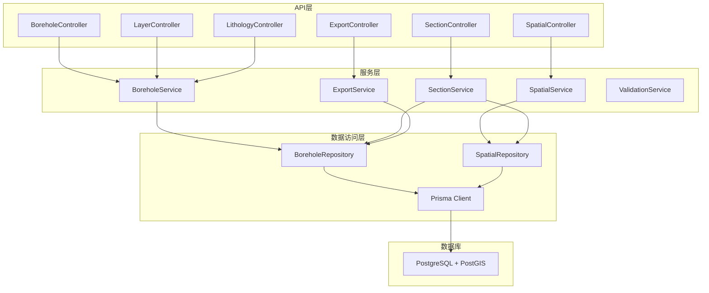
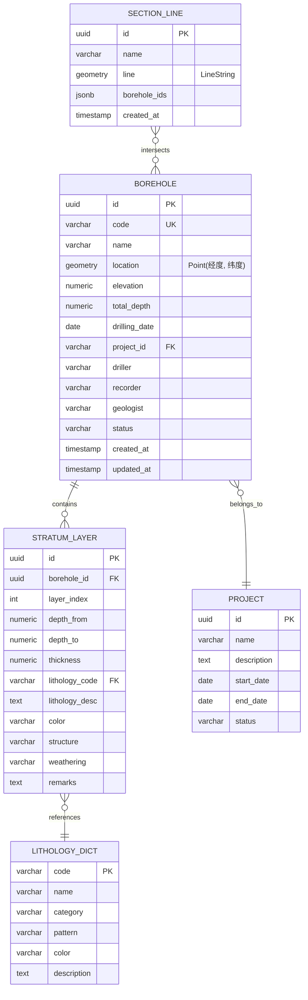

## 1. 架构设计



## 2. 技术描述

### 2.1 技术栈选择

- **前端框架**: React 18 + TypeScript
- **构建工具**: Vite 5
- **样式方案**: Tailwind CSS 3
- **状态管理**: Zustand
- **路由管理**: React Router DOM 6
- **地图组件**: Leaflet + @types/leaflet
- **图标库**: Lucide React
- **数据可视化**: 原生SVG + Canvas API
- **后端框架**: Express 4 + TypeScript
- **数据库**: PostgreSQL 15 + PostGIS 3
- **ORM**: Prisma + prisma-extension-postgis
- **数据导出**: SheetJS (Excel), jsPDF (PDF), dxf-writer (CAD)
- **HTTP客户端**: Axios

### 2.2 初始化工具

使用 `vite-init` 创建 `react-express-ts` 模板项目，包含前后端完整结构。

## 3. 路由定义

| 路由路径 | 页面名称 | 功能说明 |
|---------|----------|----------|
| / | 首页 | 数据概览、统计信息、快捷操作 |
| /boreholes | 钻孔列表 | 钻孔数据列表、筛选、批量操作 |
| /boreholes/new | 新增钻孔 | 钻孔数据录入表单 |
| /boreholes/:id | 钻孔详情 | 钻孔信息查看与编辑 |
| /boreholes/:id/chart | 柱状图 | 单钻孔柱状图展示 |
| /section | 剖面分析 | 剖面线绘制、连孔剖面图生成 |
| /spatial | 空间查询 | 地图浏览、空间查询分析 |
| /export | 数据导出 | 多格式数据导出 |

## 4. API 定义

### 4.1 TypeScript 类型定义

```typescript
// 钻孔基本信息
interface Borehole {
  id: string;
  code: string;           // 钻孔编号
  name: string;           // 钻孔名称
  longitude: number;      // 经度
  latitude: number;       // 纬度
  elevation: number;      // 孔口高程 (m)
  totalDepth: number;     // 总深度 (m)
  drillingDate: string;   // 施工日期
  project: string;        // 所属项目
  driller: string;        // 施工单位
  recorder: string;       // 记录员
  geologist: string;      // 地质工程师
  status: 'draft' | 'completed' | 'approved';
  createdAt: string;
  updatedAt: string;
  layers: StratumLayer[];
}

// 地层分层
interface StratumLayer {
  id: string;
  boreholeId: string;
  layerIndex: number;     // 层序号
  depthFrom: number;      // 层底深度 (m)
  depthTo: number;        // 层顶深度 (m)
  thickness: number;      // 厚度 (m)
  lithologyCode: string;  // 岩性代码
  lithologyName: string;  // 岩性名称
  lithologyDesc: string;  // 岩性描述
  color: string;          // 颜色
  structure: string;      // 结构构造
  weathering: string;     // 风化程度
  remarks: string;        // 备注
}

// 岩性字典
interface LithologyDict {
  code: string;
  name: string;
  category: string;       // 岩性大类
  pattern: string;        // 填充图案
  color: string;          // 显示颜色
}

// 剖面线
interface SectionLine {
  id: string;
  name: string;
  startPoint: { lng: number; lat: number };
  endPoint: { lng: number; lat: number };
  boreholes: string[];    // 经过的钻孔ID列表
  createdAt: string;
}

// 剖面数据
interface SectionData {
  sectionLine: SectionLine;
  boreholes: Borehole[];
  interpolatedLayers: InterpolatedLayer[][];
}

// 插值地层
interface InterpolatedLayer {
  lithologyCode: string;
  lithologyName: string;
  depth: number;
  position: number;       // 在剖面线上的相对位置
}

// 空间查询条件
interface SpatialQuery {
  type: 'point' | 'circle' | 'rectangle' | 'polygon';
  coordinates: number[][];
  radius?: number;        // 圆形查询半径 (米)
  filters: {
    minDepth?: number;
    maxDepth?: number;
    lithologyCodes?: string[];
    project?: string;
    dateRange?: [string, string];
  };
}
```

### 4.2 API 接口列表

| 方法 | 路径 | 说明 | 请求参数 | 响应数据 |
|------|------|------|----------|----------|
| GET | /api/boreholes | 获取钻孔列表 | page, pageSize, filters | { data: Borehole[], total: number } |
| GET | /api/boreholes/:id | 获取钻孔详情 | id | Borehole |
| POST | /api/boreholes | 创建钻孔 | Borehole | Borehole |
| PUT | /api/boreholes/:id | 更新钻孔 | id, Borehole | Borehole |
| DELETE | /api/boreholes/:id | 删除钻孔 | id | { success: boolean } |
| POST | /api/boreholes/:id/layers | 新增地层 | id, StratumLayer | StratumLayer |
| PUT | /api/boreholes/:id/layers/:layerId | 更新地层 | id, layerId, StratumLayer | StratumLayer |
| DELETE | /api/boreholes/:id/layers/:layerId | 删除地层 | id, layerId | { success: boolean } |
| GET | /api/lithology | 获取岩性字典 | category | LithologyDict[] |
| POST | /api/spatial/query | 空间查询 | SpatialQuery | Borehole[] |
| GET | /api/spatial/nearby | 附近钻孔查询 | lng, lat, radius | Borehole[] |
| POST | /api/section/generate | 生成剖面数据 | SectionLine | SectionData |
| POST | /api/export/excel | 导出Excel | boreholeIds | { url: string, filename: string } |
| POST | /api/export/chart | 导出柱状图 | boreholeId, format | { url: string, filename: string } |
| POST | /api/export/section | 导出剖面图 | sectionData, format | { url: string, filename: string } |

## 5. 服务器架构图



## 6. 数据模型

### 6.1 ER图



### 6.2 DDL 语句

```sql
-- 启用PostGIS扩展
CREATE EXTENSION IF NOT EXISTS postgis;
CREATE EXTENSION IF NOT EXISTS postgis_topology;

-- 项目表
CREATE TABLE projects (
    id UUID PRIMARY KEY DEFAULT gen_random_uuid(),
    name VARCHAR(200) NOT NULL,
    description TEXT,
    start_date DATE,
    end_date DATE,
    status VARCHAR(50) DEFAULT 'active',
    created_at TIMESTAMP DEFAULT CURRENT_TIMESTAMP,
    updated_at TIMESTAMP DEFAULT CURRENT_TIMESTAMP
);

-- 岩性字典表
CREATE TABLE lithology_dict (
    code VARCHAR(50) PRIMARY KEY,
    name VARCHAR(100) NOT NULL,
    category VARCHAR(100),
    pattern VARCHAR(100),
    color VARCHAR(50),
    description TEXT,
    created_at TIMESTAMP DEFAULT CURRENT_TIMESTAMP
);

-- 钻孔表
CREATE TABLE boreholes (
    id UUID PRIMARY KEY DEFAULT gen_random_uuid(),
    code VARCHAR(100) UNIQUE NOT NULL,
    name VARCHAR(200),
    location GEOGRAPHY(Point, 4326) NOT NULL,
    elevation NUMERIC(10, 2),
    total_depth NUMERIC(10, 2),
    drilling_date DATE,
    project_id UUID REFERENCES projects(id),
    driller VARCHAR(200),
    recorder VARCHAR(200),
    geologist VARCHAR(200),
    status VARCHAR(50) DEFAULT 'draft',
    created_at TIMESTAMP DEFAULT CURRENT_TIMESTAMP,
    updated_at TIMESTAMP DEFAULT CURRENT_TIMESTAMP
);

-- 创建空间索引
CREATE INDEX boreholes_location_idx ON boreholes USING GIST(location);

-- 地层分层表
CREATE TABLE stratum_layers (
    id UUID PRIMARY KEY DEFAULT gen_random_uuid(),
    borehole_id UUID REFERENCES boreholes(id) ON DELETE CASCADE,
    layer_index INTEGER NOT NULL,
    depth_from NUMERIC(10, 2) NOT NULL,
    depth_to NUMERIC(10, 2) NOT NULL,
    thickness NUMERIC(10, 2) NOT NULL,
    lithology_code VARCHAR(50) REFERENCES lithology_dict(code),
    lithology_desc TEXT,
    color VARCHAR(100),
    structure VARCHAR(200),
    weathering VARCHAR(100),
    remarks TEXT,
    created_at TIMESTAMP DEFAULT CURRENT_TIMESTAMP,
    updated_at TIMESTAMP DEFAULT CURRENT_TIMESTAMP,
    UNIQUE(borehole_id, layer_index)
);

-- 剖面线表
CREATE TABLE section_lines (
    id UUID PRIMARY KEY DEFAULT gen_random_uuid(),
    name VARCHAR(200) NOT NULL,
    line GEOGRAPHY(LineString, 4326) NOT NULL,
    borehole_ids JSONB,
    created_at TIMESTAMP DEFAULT CURRENT_TIMESTAMP
);

-- 创建空间索引
CREATE INDEX section_lines_line_idx ON section_lines USING GIST(line);

-- 初始化岩性字典数据
INSERT INTO lithology_dict (code, name, category, pattern, color, description) VALUES
    ('Q', '填土', '第四系', 'dots', '#D2B48C', '人工堆积的填土'),
    ('Qml', '素填土', '第四系', 'dots', '#DEB887', '由碎石、砂土、粉土等组成的填土'),
    ('Qpd', '耕植土', '第四系', 'crosshatch', '#8B4513', '含植物根茎的耕植土'),
    ('Qal', '粉质黏土', '第四系', 'diagonal', '#CD853F', '冲洪积粉质黏土'),
    ('Qpl', '粉土', '第四系', 'vertical', '#D2691E', '坡洪积粉土'),
    ('K', '泥岩', '白垩系', 'horizontal', '#696969', '白垩系泥岩'),
    ('Ks', '砂岩', '白垩系', 'brick', '#A0522D', '白垩系砂岩'),
    ('J', '页岩', '侏罗系', 'wavy', '#2F4F4F', '侏罗系页岩'),
    ('Js', '石灰岩', '侏罗系', 'dots', '#F5F5DC', '侏罗系石灰岩'),
    ('T', '花岗岩', '三叠系', 'random', '#808080', '三叠系花岗岩');
```

### 6.3 核心算法说明

#### 柱状图渲染算法

1. **坐标计算**：根据钻孔总深度和绘图区域高度计算垂直比例尺
2. **地层绘制**：按层序从上到下绘制矩形，每层高度 = 厚度 × 比例尺
3. **岩性填充**：根据岩性代码应用对应的填充图案和颜色
4. **标注生成**：自动标注层号、深度、厚度、岩性名称
5. **图例生成**：根据使用的岩性自动生成图例

#### 连孔剖面生成算法

1. **剖面线钻孔筛选**：使用PostGIS的`ST_DWithin`函数找出剖面线两侧一定距离内的钻孔
2. **钻孔投影计算**：将钻孔点投影到剖面线上，计算沿剖面线的距离位置
3. **地层对应匹配**：基于岩性代码和深度范围进行地层对比匹配
4. **地层插值算法**：
   - 线性插值：在相邻钻孔之间对同一地层的顶底深度进行线性插值
   - 克里金插值：可选的地质统计学插值方法，考虑空间相关性
5. **剖面图绘制**：
   - X轴：沿剖面线的水平距离
   - Y轴：海拔高程（孔口高程 - 地层深度）
   - 连接各钻孔对应地层的顶底点形成地层分界线
   - 填充岩性图案和颜色

#### 空间查询算法

1. **点查询**：`ST_DWithin(location, ST_MakePoint(lng, lat)::geography, radius)`
2. **矩形查询**：`ST_Intersects(location, ST_MakeEnvelope(minLng, minLat, maxLng, maxLat, 4326)::geography)`
3. **多边形查询**：`ST_Intersects(location, ST_Polygon(ST_MakeLine(points), 4326)::geography)`
4. **缓冲区查询**：`ST_DWithin(ST_Buffer(geometry, radius), location)`
